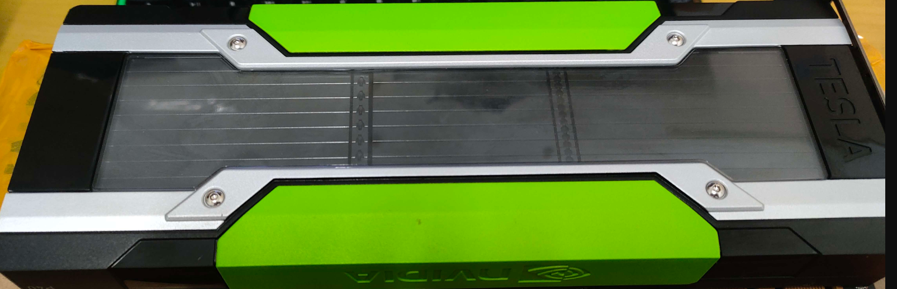
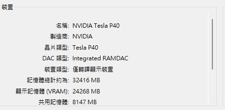
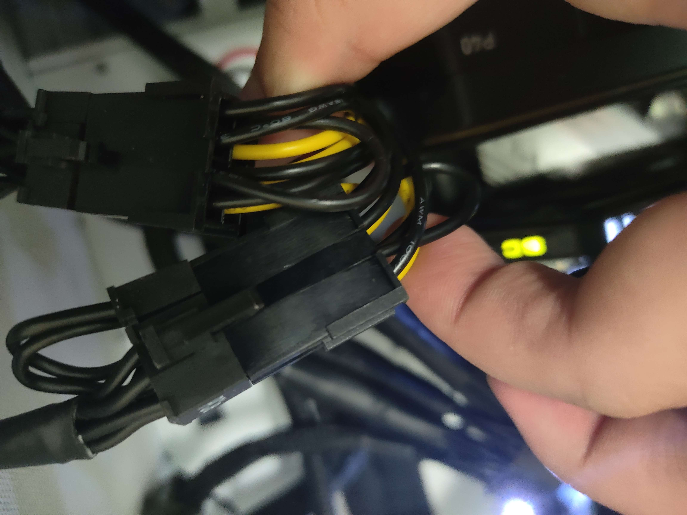
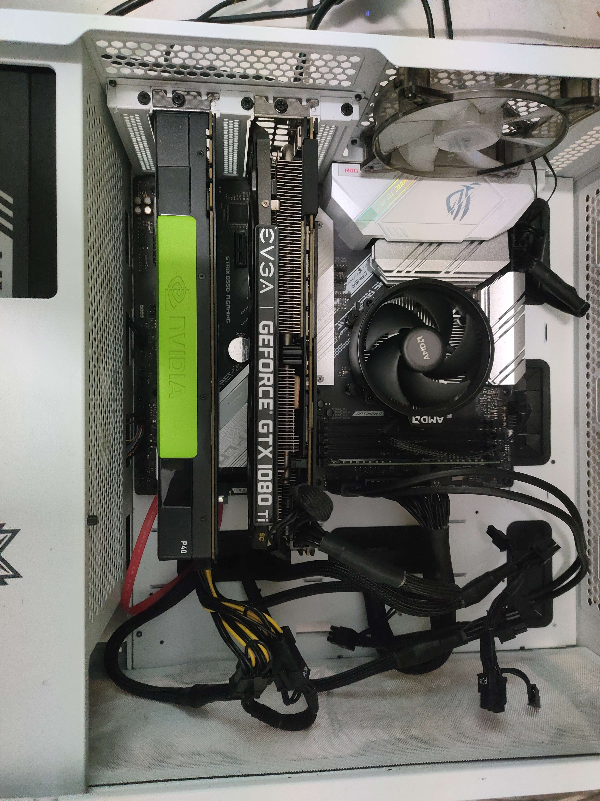

English | [繁體中文](README_TCH.md)
# How to Use Tesla P40
A guide to help you use the Tesla P40. The author encountered many problems during the installation of the P40, which is why they wrote this installation guide. Hopefully, it can help users who want to use the P40.

  

## Why Choose P40?
The P40 is a graphics card with computing power close to that of the 1080, which is not particularly remarkable, but it has 24GB of memory, which is a level that is difficult for most consumer cards on the market to reach. Although the computing power itself may not keep up with the times, it is a highly recommended entry-level card for AI training and use due to its low price and cost-effective memory, which can support most AI models provided online.

## Pros and Cons
* Pros
  * Large memory capacity (24GB)
  * Relatively low price
  * Suitable for AI training
* Cons
  * Not too high computing power
  * No external display interface
  * No active cooling
  * Requires some hands-on skills and patience
  * (Most) no warranty
## Prerequisites
Before you start, you may need to prepare some things.

A graphics card for displaying on the screen, a power supply large enough, a motherboard with ATX version recommended that can accommodate two graphics cards, two extra 6+2pin power supply interfaces, and an 8pin adapter interface for the P40. Additionally, it is recommended that you prepare cooling equipment because the P40 does not have active cooling and requires self-modification.

8(6+2) pin to 8 pin adapter

The hardware that the author prepared includes a 1200w Corsair power supply, a GTX 1080ti graphics card for display, and a P40 with a self-made cooling fan.

  

Regarding the system, it is recommended to use at least Windows 10 or a newer version. The author uses the latest version of Windows 11.
